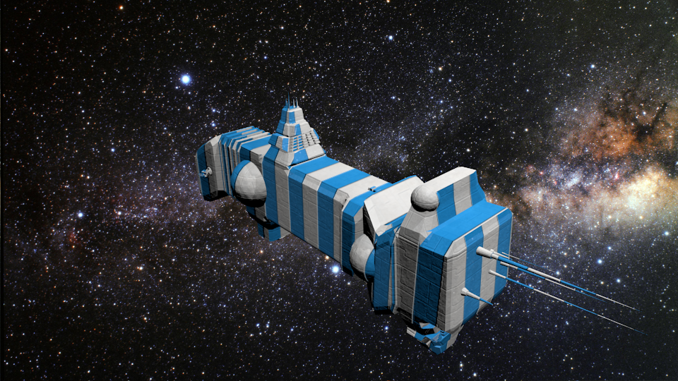
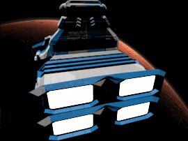

# spacesh1ps
Procedural spaceship generator in Python.

This uses the awesome <a href="https://github.com/a1studmuffin/SpaceshipGenerator">SpaceshipGenerator</a> blender script by <a href="https://github.com/a1studmuffin">Michael Davies</a> to generate spaceships and post them to twitter, tumblr and mastodon. 

I currently have it designed to run on a schedule every 6 hours and it generates an animated gif once a day at midnight, other times it just generates a single ship image.

I made the *loosely* Chriss Foss inspired hull and light textures in Photoshop, the space backgrounds are all CC0 images mostly from nasa.  I also added a spaceship name generator.

Operation: 
`python spacesh1ps.py`

Requirements:
- ImageMagic to generate the animated gifs.
- Tweepy for posting tweets.
- pyTumblr for posting to Tumblr.
- Mastodon.py for posting to Mastodon.

 
Example Accounts:
- https://twitter.com/spacesh1ps
- http://space-sh1ps.tumblr.com
- https://botsin.space/@spacesh1ps
